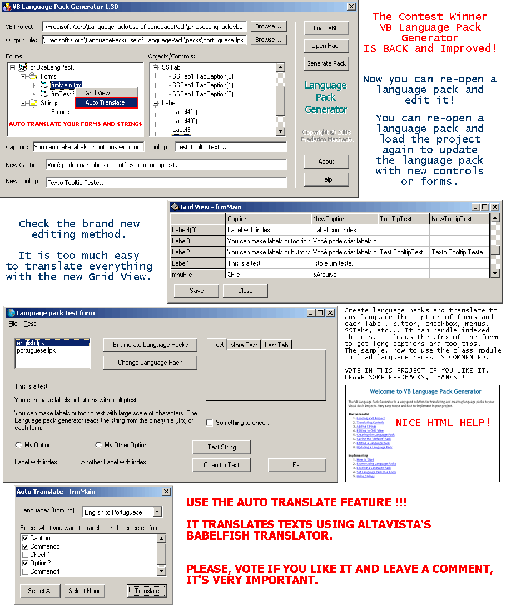

<div align="center">

## VB Language Pack Generator 1\.40


</div>

### Description

VB Language Pack Generator is a Powerful and complete application for you to quickly generate language packs to your VB projects. You need to load a project, and translate your labels, menus, buttons, SSTabs, etc... It is able to translate control arrays and indexed menus too. It can load large captions or tooltips from the binary (.FRX) file of the form. The example, how to use the class module to load language packs is heavly commented. NOW IT HAS A Grid View to fast editing controls of forms and strings. YOU CAN RE-OPEN an existing language pack to edit and save again. YOU CAN UPDATE AN EXISTING language pack by re-opening it and re-loading the project to add new controls and forms to the pack. YOU CAN AUTO-TRANSLATE FORMS AND STRINGS. Vote for me if you like it. Feel free for give me some help to implement it. Thanks!!
 
### More Info
 


<span>             |<span>
---                |---
**Submitted On**   |2005-09-05 00:22:32
**By**             |[Frederico Machado](https://github.com/Planet-Source-Code/PSCIndex/blob/master/ByAuthor/frederico-machado.md)
**Level**          |Intermediate
**User Rating**    |4.8 (129 globes from 27 users)
**Compatibility**  |VB 6\.0
**Category**       |[Complete Applications](https://github.com/Planet-Source-Code/PSCIndex/blob/master/ByCategory/complete-applications__1-27.md)
**World**          |[Visual Basic](https://github.com/Planet-Source-Code/PSCIndex/blob/master/ByWorld/visual-basic.md)
**Archive File**   |[VB\_Languag192986952005\.zip](https://github.com/Planet-Source-Code/frederico-machado-vb-language-pack-generator-1-40__1-62437/archive/master.zip)

### API Declarations

```
LOAD A VB PROJECT, TRANSLATE EVERYTING OR JUST USE THE AUTO-TRANSLATE FEATURE. YOU CAN TRANSLATE USING A NICE GRID VIEW.
YOU NEVER SAW SOMETHING LIKE THIS.
LEAVE A COMMENT AND VOTE IF YOU LIKE PLEASE.
THANKS!!
```


